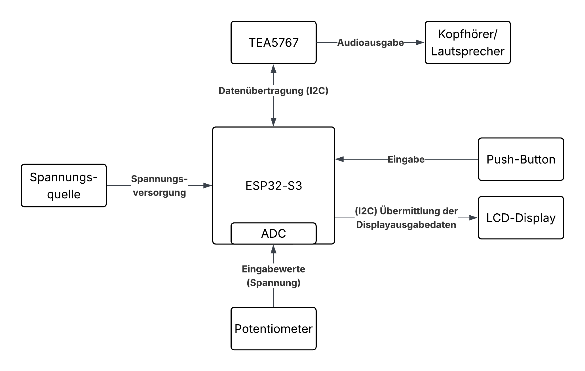
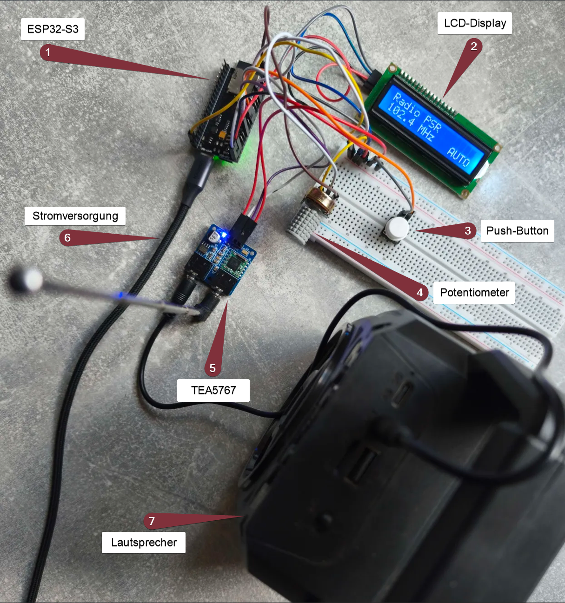
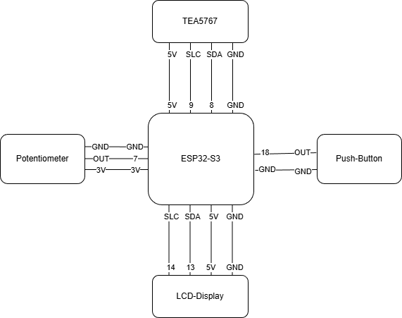
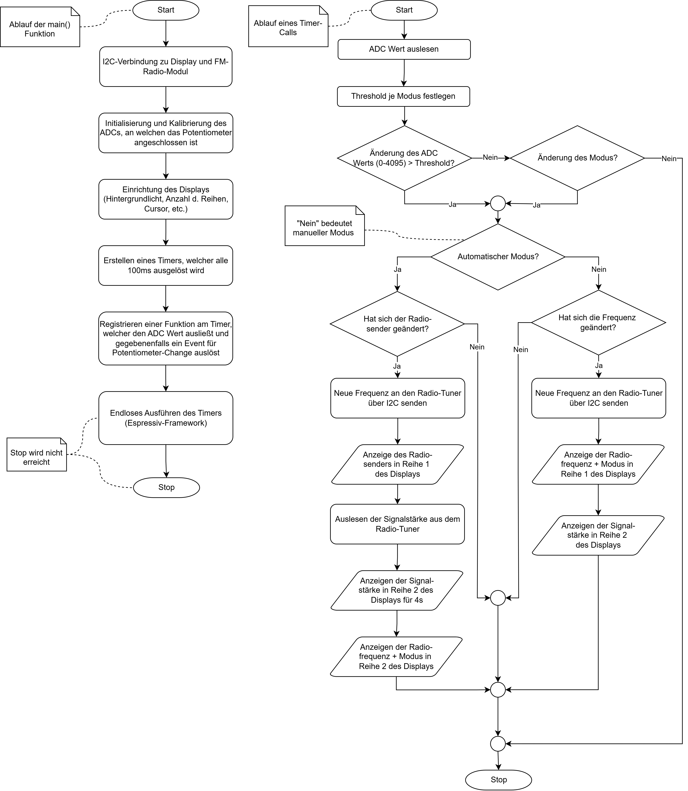

# Aufbau eines UKW-Radios mit benutzerfreundlicher Ein- und Ausgabe
_Projektarbeit von Jessica Kraus (s3005786) und Paul Zenker (s3005664)_

> Diese Datei ist die `README.md` des Repositories, welche auch hier: [https://github.com/KuramaSyu/Radio-Projekt-Semester-4](https://github.com/KuramaSyu/Radio-Projekt-Semester-4) gelesen werden kann. Die PDF ist ein Export der `README.md`.

Im Rahmen des Projektes im Modul Embedded Systems wurde ein UKW-Radio auf Basis eines ESP32-Mikrocontrollers und des Radio-Tuner-Moduls TEA5767 gefertigt. Ziel war ein funktionsfähiges Radiogerät mit benutzerfreundlicher Ein- und Ausgabe, welches durch die Kombination aus Hardware und Software umgesetzt werden konnte. So steht als Eingabegerät ein Potentiometer zur Verfügung, mit welchem die Frequenz und damit der Radiosender geändert werden kann. Die Ausgabe wurde durch ein LCD-Display realisiert, auf welchem nützliche Informationen ausgegeben werden. Es wurde weitestgehend auf Bibliotheken verzichtet, um eine möglichst hardwarenahe Programmierung zu gewährleisten.


# Motivation

Das Radio ist noch heute ein wichtiges und weit verbreitetes Unterhaltungs- und Informationsmedium. Der Aufbau eines eigenen UKW-Empfängers bietet eine gute Gelegenheit, um theoretisches Wissen aus der Vorlesung in der Praxis anzuwenden und so ein tieferes Verständnis für die Funktionsweise von Mikrocontrollern zu entwickeln. Auch der Umgang mit unterschiedlichen elektronischen Komponenten und Kommunikationsschnittstellen kann im selben Kontext erprobt und wichtige Erfahrungen im Bereich Embedded Systems gesammelt werden.


# Verwendete Hardware-Komponenten

Folgende Tabelle gibt einen Überblick über alle verwendeten Komponenten:

| Komponente | Funktion |
| --- | --- |
| ESP32-S3 | Zentrale Steuereinheit |
| TEA5767 | FM-Radio-Tuner |
| Potentiometer | Eingabegerät zur Einstellung der gewünschten Frequenz |
| Push-Button | Eingabe zur Umschaltung zwischen freiem und automatischem Modus |
| Display | Ausgabegerät zur Anzeige von Sender, Frequenz und Signalstärke |
| Lautsprecher/Kopfhörer | Audioausgabe |
| Breadboard/Kabel | Elektrische Verbindung aller Komponenten |
| Spannungsquelle | Stromversorgung des Systems |


Die wichtigsten Komponenten werden im Folgenden nochmals näher betrachtet.


## ESP32-S3 Mikrocontroller

Beim ESP32-S3 handelt es sich um einen Mikrocontroller der Firma Espressif. Er zeichnet sich durch einen Dual-Core-Prozessor, eine 240 MHz Taktfrequenz und eine Vielzahl von GPIO-Pins und Schnittstellen aus. Insbesondere die I2C-Schnittstelle ist zur Ansteuerung des Displays und des Radio-Tuners essenziell. Auch der interne ADC spielt eine große Rolle beim Auslesen des Potentiometers.

## TEA5767

Der TEA5767 ist ein Radioempfänger, welcher UKW-Empfang im Bereich von 87,5-108MHz bereitstellt. Er wird über eine I2C-Schnittstelle initialisiert, gesteuert und ausgelesen. Er ermöglicht das freie Einstellen einer Frequenz im oben genannten Frequenzbereich und das Auslesen der Signalstärke. Der Weiteren besitzt er eine Antenne, die zur Verbesserung der Signalstärke beiträgt und bietet einen AUX-Anschluss, über welchen sich Kopfhörer oder Lautsprecher zur Audioausgabe verbinden lassen.

## Potentiometer

Beim Potentiometer handelt es sich um einen veränderbaren Widerstand, dessen Ausgangsspannung sich abhängig von der Position des Drehreglers ändert. Der ESP liest diesen Spannungswert aus und wandelt diesen mittels des ADC in einen Wert zwischen 0 und 4096 um. Diese Werte können Frequenzen zugeordnet werden, sodass durch Bedienung des Drehreglers des Potentiometers durch den Benutzer eine Änderung der Radiofrequenz und damit des Radiosenders herbeigeführt werden kann. Das Potentiometer bietet sich also als benutzerfreundliches Eingabegerät an.

## Display

Als Ausgabegerät bietet sich ein LCD-Display an, um Informationen an den Benutzer zu übermitteln. Das verwendete Display bietet zwei Zeilen, auf denen sich je 16 Zeichen anzeigen lassen. Es wird über eine I2C-Schnittstelle vom ESP32 initialisiert und gesteuert. Über das Display werden dem Benutzer der aktuell eingestellte Modus, die Radiofrequenz, die aktuelle Signalstärke sowie gegebenenfalls der Name des eingestellten Radiosenders visuell bereitgestellt.


# Schaltungsaufbau

Alle Komponenten sind über das Breadboard oder Jumper-Kabel miteinander verbunden. Das folgende Blockschaltbild zeigt den groben Aufbau der Schaltung:




Die folgende Abbildung zeigt den realen Aufbau der Schaltung:



Die Verbindungen und Pin Belegungen werden im folgenden Diagramm dargestellt:




# Softwareentwicklung

Als Entwicklungsumgebung wurde sich für Visual Studio Code mit der „Platform IO“-Extension entschieden. Das Programm wurde in C geschrieben und ist modular aufgebaut. Es wurde sich **gegen das Arduino Framework und stattdessen für ESP-IDF entschieden**, wodurch die verwendeten Bibliotheken reduziert wurden auf:
- offizielle ESP-IDF Bibliotheken, welche mit der Installation vom Espressif-Installation-Manager "EIM" verfügbar sind (siehe: [offizieller Espressif-Installationsguide](https://docs.espressif.com/projects/esp-idf/en/stable/esp32/get-started/windows-setup.html)). Das Espressif-Framework ist verglichen mit Arduino sehr minimalistisch. Driver für I2C und das Ansteuern der GPIO-Pins sind verfügbar; Driver spezifischer Teile, wie ein Push-Button, Display oder Radio-Tuner mussten selbst umgesetzt werden.
- `stdio.h` verwendet für Input/Output und somit String-Formatierungen. Vor allem für das Display-Output verwendet
- `math.h` verwendet für Float-Operationen


## Codestruktur
Der folgende Codeblock stellt den Aufbau des Projektes dar, einschließlich wichtiger, allerdings nicht aller Dateien.
```
.
├── README.md
├── include
│   ├── app_state.h
│   ├── config.h
│   ├── ... header files for all drivers
└── src
    ├── drivers
    ├── interrupts.c
    ├── main.c
    ├── timers.c
    └── view
```
### Ordner
- `src/`: Ordner, in welchem die Implementierungen aller Komponenten und der Startpunkt des Programms (`src/main.c`) liegen
- `src/view/`: Enthält Methoden, welche für die Display-Ausgabe verwendet werden (primär String-Formatierungen)
- `src/drivers/`: Enthält die Driver für alle verwendeten Komponenten, da es in der Espressif-IDF nur sehr wenige fertige Driver gibt
- `include/`: Zentraler Ordner für alle Header-Dateien. Diese definieren die Methoden der dazugehörigen `.c` Dateien und **enthalten die Doc-Strings der Methoden**. Es sind nur diejenigen Methoden definiert, welche auch außerhalb der jeweiligen `.c` Datei zu finden, also keine privaten Methoden sind.

### Wichtige Dateien
- `src/main.c`: Der Startpunkt des Programms. Hier werden alle Komponenten initialisiert (Display, Radio-Tuner, ADC für das Potentiometer, GPIO-Konfiguration für den Push-Button). Nach der Initialisierung wird ein Timer und ein Interrupt registriert. Diese sind für den Programmablauf verantwortlich. Mehr dazu in `src/timers.c` und `src/interrupts.c`
- `src/timers.c`: Enthält das Callback (`pot_timer_task`) für den in der Main-Funktion registrierten Timer. Dieser überprüft den Potentiometerwert und den Zustand (Modus) des Programms (Automatisch/Manuell) und aktualisiert anschließend die Radiofrequenz und die Display-Ausgabe. Mehr dazu in Abschnitt "Programmablauf"
- `src/interrupts.c`: Enthält den Callback für die, in `src/main.c:main` registrierten, Interrupt-Service-Routine (ISR). Diese löst aus, sobald der Push-Button betätigt wird (`src/drivers/button.c:button_init`). Der Knopfdruck ändert den Zustand/Modus des Programms zwischen automatisch und manuell. Da der Interrupt keine Queue nutzt, sondern direkt abläuft, muss dieser minimalistisch und kurz sein. Daher wird eine globale Variable `machine_state` geändert, welche vom, alle 100ms laufenden, Timer auf Änderung überprüft wird.
- `include/app_state.h`: Definiert ein Enum und die globalen Variablen für den Zustand. Dieser ist entweder `STATE_MANUAL` oder `STATE_HALF_AUTO`.
- `include/config.h`: Enthält Definitionen für die verwendeten GPIO-Pins, ADCs und I2C-Adressen.


## Programmablauf
Es wurde sich gegen einen klassischen While-Loop entschieden, stattdessen wird in der Main-Funktion ein Timer registriert, welcher alle 100ms ausgelöst wird und gegebenenfalls ein Event für Potentiometer-Änderung auslöst (`src/timers.c:on_pot_change Notation: dateipfad:methode`). Der folgende Programm-Ablaufplan stellt sowohl die `main`-Funktion als auch das Timer-Event dar:



### Auslösen der Display Updates
Das Display wird unter folgenden Bedingungen aktualisiert:
- Das Potentiometer wurde stark genug verändert ODER
- Der verwendete Modus wurde verändert (Frei / Automatisch)

Für das Radio wurden zwei unterschiedliche Modi implementiert: der automatische Modus, bei dem nur zwischen fest definierten Sendern/Frequenzen umgeschalten werden kann und der freie bzw. manuelle Modus, bei dem beliebige Frequenzen eingestellt werden können. Durch einen Knopfdruck kann beliebig zwischen den Modi umgeschalten werden. Beide Modi werden im Folgenden näher betrachtet.

### Automatischer Modus
Der automatische Modus bietet die Möglichkeit zwischen festgelegten Sendern zu wechseln und dabei das störende Rauschen „zwischen“ den Sendern zu überspringen. Folgende Sender werden dabei unterstützt:


| Radiofrequenz | Sendername |
 --- | ---
| 89.2 | R.SA | 
| 90.1 | MDR Jump |
| 92.2 | MDR Sachsen |
| 95.4 | MDR Kultur |
| 97.3 | Deutschlandfunk |
| 100.2 | ENERGY Dresden |
| 102.4 | Radio PSR |
| 103.5 | Radio Dresden |
| 105.2 | HitRadio RTL |

Das Wechseln der Radiofrequenz und damit des Senders erfolgt durch Bedienung des Drehreglers des Potentiometers.

### Manueller / Freier Modus

Der freie Modus unterscheidet sich insofern vom automatischen Modus, dass keine Sprünge zwischen Radiosendern erfolgen, sondern der gesamte Frequenzbereich zwischen 87,5 und 108 MHz abgetastet werden kann. Bei Bedienung des Drehreglers können so auch Frequenzen "zwischen" den gängigen Radiosendern eingestellt werden. Des Weiteren unterscheidet sich die Displayanzeige bei Nutzung des freien Modus. Anstelle des Namens des Radiosenders wird nun die aktuelle Frequenz in Zeile 1 des Displays angezeigt sowie am Ende der Zeile mit "FREI" ein Indikator auf den aktuellen Modus. In Zeile 2 wird nun dauerhaft die Signalstärke angezeigt.   

### Detaillierter Programmablauf:
1. **Initialisierung des Interrupt-Handlers, der I2C-Verbindungen, des ADC und des Buttons**

    Zu Beginn des Programms wird zunächst der Interrupt-Handler konfiguriert, um beim Drücken des Push-Buttons ein Event auszulösen. Anschließend wird die I2C-Verbindung zum Display und anschließend jene zum TEA5767 konfiguriert. Darauf folgt die Initialisierung des ADC, welcher die ausgelesenen analogen Werte des Potentiometers in digitale Werte im Bereich von 0-4095 umwandelt. Als Nächstes wird der Push-Button konfiguriert und im Anschluss das Display initialisiert.
   
2. **Initialisierung des Displays**

    Dem Display wird zunächst drei Mal ein „reset“-Befehl gesendet, um es aus jeglichen Zuständen, in denen es sich befinden könnte, herauszuholen. Anschließend wird in der 4-Bit-Modus eingestellt, die Größe des Displays auf zwei Zeilen mit einer 5x8 Textgröße festgelegt. Daraufhin folgt ein Befehl zur Aktivierung des Displays, wobei der Cursor und das Blinken deaktiviert wird. Im Anschluss wird das Display kurz ausgeschalten, ein „clear“-Befehl wird gesendet und nach 2 Millisekunden wird das Display wieder eingeschalten, nachdem der „entry-mode“ gesetzt wurde. Damit ist die Initialisierung des Displays abgeschlossen und es folgt der Setup des Timers.
   
3. **Setup des Timers**

    Der Timer fungiert in diesem Programm als Loop-Funktion und ersetzt damit die häufig verwendete While-Schleife. Ziel ist es, periodisch den Potentiometerwert auszulesen und bei einer Änderung gegebenenfalls neue Anweisungen an das Radio-Modul sowie das Display zu senden. Zunächst wird der aktuelle Potentiometerwert ausgelesen. Dieser wird mit dem letzten gespeicherten Potentiometerwert verrechnet. Übersteigt die Differenz einen bestimmten Threshold, welcher abhängig vom aktuellen Modus ist (35 im freien, 80 im automatischen Modus), wird eine Änderung des Potentiometers erkannt und eine Funktion wird aufgerufen. Falls das Radio sich im automatischen Modus befindet, prüft die Funktion, ob durch die Änderung ein Senderwechsel erfolgen soll.

   _Zur Veranschaulichung ein Beispiel:
    Sender A ist dem Potentiometer-Wertebereich 0-500 zugeordnet, Sender B dem Bereich von 501-1000. Der letzte Potentiometerwert betrug 380. Der aktuelle Sender ist daher Sender A. Nun wird eine Potentiometer-Änderung von 100 erfasst, der neue Wert beträgt also 480. Dieser liegt weiterhin im Bereich von Sender A, es findet also kein Senderwechsel statt. Nun wird eine weitere Potentiometer-Änderung von +100 erfasst, der neue Wert beträgt also 580. Dieser liegt im Bereich von Sender B, womit ein Senderwechsel eingeleitet wird._

    Der Befehl zur Änderung der Radiofrequenz wird dann an den Radio-Tuner gesendet und dem Display wird der Sendername übergeben, welcher in Zeile 1 angezeigt werden soll. Anschließend wird vom Radio-Modul die Signalstärke ausgelesen und an das Display übermittelt, um diese für 4 Sekunden in Zeile 2 anzeigen zu lassen. Nach den vier Sekunden wird die aktuelle Frequenz an das Display übertragen, welche anschließend in Zeile 2 angezeigt werden soll. Am Ende der zweiten Display-Zeile wird mit "AUTO" der aktuelle Modus abgebildet.

    Befindet sich das Radio im freien Modus, wird die Frequenz direkt entsprechend der Potentiometeränderung angepasst und an den Radio-Tuner übermittelt. Anschließend wird diese Frequenz zur Darstellung an das Display übertragen, sowie der Befehl zur Anzeige des Modus-Indikators "FREI" am Ende der ersten Zeile. Zusätzlich wird die Signalstärke vom Radio-Modul ausgelesen und an das Display übergeben, um diese in Zeile 2 anzeigen zu lassen.

4. **Wechseln des Zustandes**

    Sobald der Push-Button betätigt wird, löst der zu Programmbeginn initiierte Interrupt aus, welcher zum Umschalten zwischen automatischem und manuellem/freiem Modus dient. Um den Code weitestgehend simpel zu halten, wurde auf eine Interrupt-Queue verzichtet und der Interrupt wird direkt behandelt. Dadurch entsteht die Herausforderung, dass der Interrupt möglichst schnell ablaufen muss, wodurch nicht direkt im Interrupt das Display aktualisiert werden sollte. Daher wurde sich für eine globale Variable `machine_state` (`include/app_state.h`) entschieden, welche zwischen den zwei Modi hin und her wechselt. Damit nun tatsächlich das Display aktualisiert wird, wurde der Timer vom letzten Schritt mit einem Check erweitert, ob sich der Zustand (`machnine_state`) geändert hat. Falls dies zutrifft, wird das Display und die Frequenz auf jeden Fall aktualisiert (wie auch im Timer-Ablauf dargestellt).
   
### Vergleich zwischen automatischem und freiem Modus

Die folgende Tabelle stellt kurz die Vor- und Nachteile der beiden Modi gegenüber:

| | Automatischer Modus | Freier Modus |
 --- | --- | ---
| Vorteile | einfachere Sendersuche; Rauschen zwischen Sendern wird übersprungen; Anzeige des Sendernamen | keine Beschränkung auf definierte Sender |
| Nachteile | Beschränkung auf definierte Sender | Feinjustierungen beim Einstellen der Frequenz notwendig; keine Sendernamen |

# Fazit

Im Rahmen des Projektes konnte ein funktionsfähiges UKW-Radio auf Basis des ESP32-S3-Mikrocontrollers und des Radio-Tuners TEA5767 erfolgreich umgesetzt werden. Das Ziel der benutzerfreundlichen Ein- und Ausgabe konnte durch ein Zusammenspiel aus Software und Hardware realisiert werden. Besonders wurde sich auf eine hardwarenahe Programmierung konzentriert. 

Durch die Verwendung der ESP-IDF anstelle des Arduino Frameworks hielt sich die Anzahl der verwendeten Bibliotheken in Grenzen und zentrale Komponenten, wie Benutzereingaben, Ansteuerung des Displays und Kommunikation über I2C mussten eigenhändig implementiert werden. So konnte ein tieferes Verständnis für die Funktionsweise von Mikrocontrollern, Interrups, Timern und Kommunikationsschnittstellen erlangt werden.

Der modulare Aufbau des Programms gewährleistet eine klare und übersicktliche Struktur bietet zusätlich die Möglichkeit der Erweiterung. So kann das Programm jederzeit um weitere Modi, Ein- und Ausgabetools oder Funktionen ergänzt werden. 

Zusammenfasssend lässt sich sagen, dass durch dieses Projekt umfangreiche Kenntnisse im Umgang mit Mikrocontrollern, Schaltungen, Projektorganisation und Systemintegration gewonnen werden konnten. Des weiteren konnte theoretisches Wissen aus der Vorlesung praktisch angewendet und vertieft sowie wichtige Erfahrungen im Bereich Embedded Systems gesammelt werden.  
